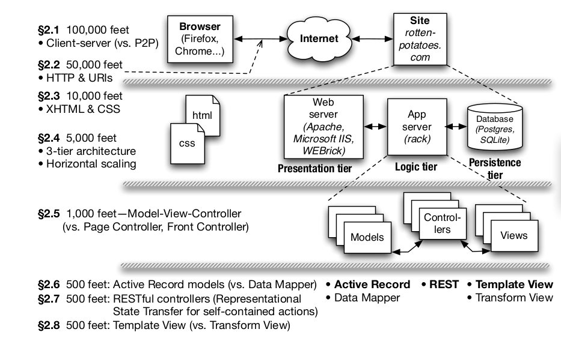

## Semana 4: Arquitectura de aplicación SaaS

**CC 3S2: Desarrollo de software**

### Descripción general

1. Cuál es la diferencia principal entre un cliente y un servidor en SaaS?
2. Qué elemento(s) de la figura siguiente se refiere(n) a un cliente SaaS y cuál(es) a un servidor SaaS?

   
3. ¿Es DNS un protocolo cliente-servidor? ¿Por qué o por qué no?
4. Si el servicio DNS dejara de funcionar, ¿se podría seguir navegando por la web? Explique por qué o por qué no.
5. ¿Se puede establecer una conexión TCP sin especificar un número de puerto y, de ser así, qué sucede?
6. Verdadero o falso: HTTP como protocolo no tiene el concepto de “sesión” que consiste en una secuencia de solicitudes HTTP relacionadas al mismo sitio.
7. Muchos servidores HTTP se basan en el uso de cookies HTTP para identificar a un cliente en solicitudes repetidas al mismo sitio, por ejemplo, para rastrear información como si ese usuario ha iniciado sesión. ¿Qué ocurre si deshabilitas por completo las cookies en tu navegador e intentas visitar un sitio de este tipo?
8. Supongamos que las cookies HTTP no existieran. ¿Podrías pensar otra forma de seguir a un usuario a través de diferentes vistas de páginas?
9. Indica qué números de puerto están involucrados en los siguientes URI y por qué:

    - `https://paypal.com`
    - `http://mysite.com:8000/index`
    - `ssh://root@cs.berkeley.edu/tmp/file`

10. Tal y como se describe en la documentación de la API de búsqueda de DuckDuckGo, puedes buscar un término con el motor de búsqueda DuckDuckGo construyendo un URI que incluya el término buscado como un parámetro llamado `q`, como por ejemplo `http://api.duckduckgo.com/?q=saas` para buscar el término `saas`. Sin embargo algunos caracteres no pueden formar parte del URI por ser "caracteres especiales", como por ejemplo espacios, `?` y `&`. Dada esta restricción, construye un URI válido para realizar una búsqueda con DuckDuckGo de los términos `M&M` y `100%?`.
11. Otra visión de SOA es que es simplemente un enfoque de sentido común para mejorar la productividad del programador. ¿Qué mecanismo de productividad ejemplifica mejor SOA: claridad a través de concisión, síntesis, reutilización o automatización y herramientas?

### HTTP, RESTful

Trabaja en pares

**Request**

Sin consultar ninguna documentación, analiza lo que podrían hacer las siguientes solicitudes HTTP (no se requiere un formato de respuesta específico, solo una idea general). **Nota**: Estos enlaces no funcionan, pero determinan qué harían el tipo de solicitud y los argumentos si existieran.

- `GET https://github.com/orgs/cs3s2/repos`
- `GET https://github.com/repos/cs3s2/tarea2`
- `POST https://github.com/orgs/cs3s2/repos`

**Documentación de API**

Lee la documentación de la API de GitHub, que se puede encontrar en https://developer.github.com/v3. Encuentra las respuestas a las siguientes preguntas.

 - ¿Cómo puedo obtener información disponible públicamente sobre un usuario?
 - ¿Cómo puedo enumerar todas los pull request de un repositorio?
 - ¿Cómo puedo obtener todos los pull request  cerrados de un repositorio?
 - ¿Cómo puedo crear un nuevo pull request?
 - ¿Qué valores de entrada se requieren para crear un nuevo pull request?

**Implementación de API**

Termina la siguiente implementación de Ruby para una API de tareas sencilla. Debes suponer que tienes acceso a un hash de parámetros de consulta necesarios, junto con una función `format_as_json(object), que  devuelve resultados como JSON cuando corresponda. Revisa: https://sinatrarb.com/. 

   ```
  class User
    attr_reader :id
    attr_accessor :todo

    def initialize
      @id = app.get_new_user_id
      @todo = Todo.new
    end
  end
  
  class Todo
    def initialize
      @items = Array.new
    end

    def add item
      if not @items.include? item
        @items << item
      end
    end

    def delete item
      @items.delete item
    end

    def view_item item_id
      # debes suponer que cada instancia de elemento tiene un campo ID accesible
      #  y que todos los elementos/id's son unicos
      item = 
      format_as_json item unless item.nil?
    end
  end

  get '/user/:id/todo' do
    user = get_user_by_id params[:id]
  ...
  end

  get '/user/:id/todo/:item_id' do
    user = get_user_by_id params[:id]
  ...
  end

  post '/user/:id/todo' do
    user = get_user_by_id params[:id]
    request.body.rewind
    raw_item = JSON.parse request.body.read
  end

  delete '/user/:id/todo/:item' do
    user = get_user_by_id params[:id]
    ...
  end
  ```

